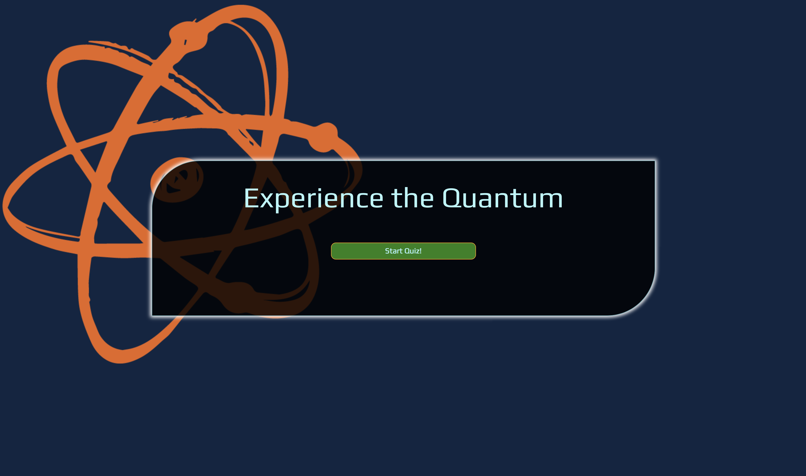

# Quantum Quiz App

An online quiz application testing your knowledge of the Quantum. 

## Inspiration

Quantum Mechanics always amazed me and had my interest. The physics of the infinitesimally small paired with the nuances of jQuery and Javascript paired together, perfection.

## Screenshots
Landing Page:

Question Page:

Positive Feedback:

End:

## Summary

Quantum Quiz App is an online quiz application that guides the user through a series of questions while tracking the users score and providing feedback after each submission.

### Technology Used

Javascript, jQuery, HTML, CSS

### Live Link:
https://tone2k.github.io/Quantum-Quiz-App/
